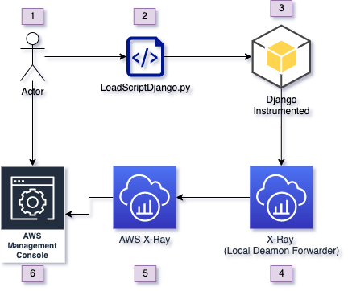

# ApplicationObservability-Blueprint

## Purpose
The purpose of the Application Observability foundations is to provide a foundational example of observability utilizing AWS services AWS X-ray.

### Overview
For financial services organizations, observability is critical. In this solution, we will utilize 1 "pane" of glass. This pane of glass comes in the form of AWS X-Ray. A sample load script will be run to generate data for AWS X-Ray.

### Architecture
The following diagram illustrates the architecture of the Application Observability foundations:

### Architecture Flow:
- Actor: This is the user that will execute the load script. The load script will generate load on AWS X-Ray via a simple python program.
- LoadScriptDjango.py: This load script generates load on X-Ray application creating spans.
- Amazon EC2: This is the main and primary instance which Docker will be deployed.
- Django: This is a sample application that will be instrumented with OpenTelemetry
- X-Ray (Local): AWS X-Ray local daemon that will forward spans & segments to AWS. This daemon is NOT required when using AWS Lambda, as native support exists for X-Ray.
- X-Ray (US-East-1): AWS X-Ray in US-East-1. X-Ray applications are scoped to a region.

## Prerequisites
- You must have Python 3.8 or later installed and configured
- You must have AWS CDK installed and configured
- You must have your ~/.aws/credentials file configured with the appropriate profile
- You must clone this repository `https://github.com/VerticalRelevance/ApplicationObservability-Blueprint`

## Pre-Deployment(Configuration)
The following are modifications to the code you must perform to have it work for your environment

### app.py
- Line 73: Change this to your AWS account number and region you are targeting. 

### LoadScriptDjango.py
- Line 20: Change username
- Line 21: Change password

## Deployment
Once all prerequisites have been satisfied, perform the following operations to deploy the project:

1) Run the command `cdk bootstrap` from within the repository and `cdk deploy --all` to deploy all the stacks.
2) On first run it will generate at least 1 stack that contains an EC2 instance, X-Ray running and willing to accept data, and a Django application that is instrumented for AWS X-Ray. 
3) From this point forward, AWS X-Ray are accepting new segment and span data. 

## Load Generation

Load generation can happen either via the `LoadScriptDjango.py` or via manual interaction. 
Make sure you have the target IP of the machine you just launched. To find this out, navigate to the AWS Console and find the recently launched EC2.

## Teardown
Ensure you have the appropriate credentials configured and perform the following step to tear down the application observability blueprint:

1) Run the command `cdk destroy --all` to teardown all the deployed resources.

All deployed resources should now be removed from the target account.

## Connecting to your EC2 instance
`aws ssm start-session --target i-02133257a1079f3f7`

## Viewing your userdata script output
`cat /var/log/cloud-init.log`
`sudo cat /var/log/cloud-init-output.log`

## Run local Django with no reload
'python3 manage.py runserver 0.0.0.0:8000 --noreload'